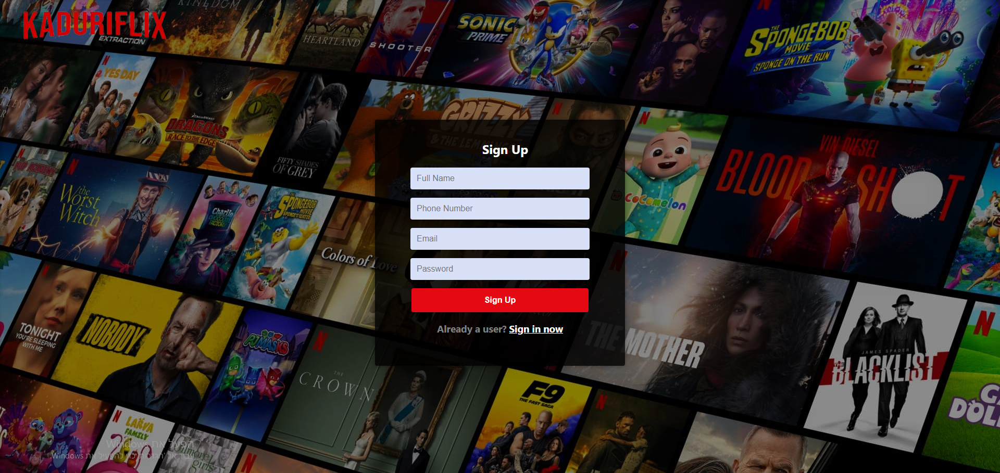
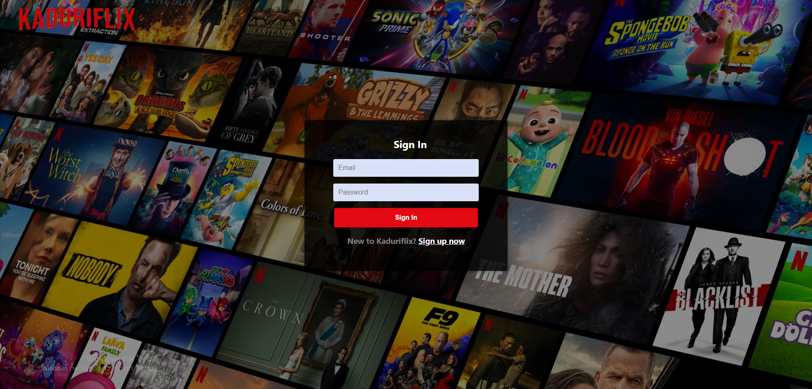
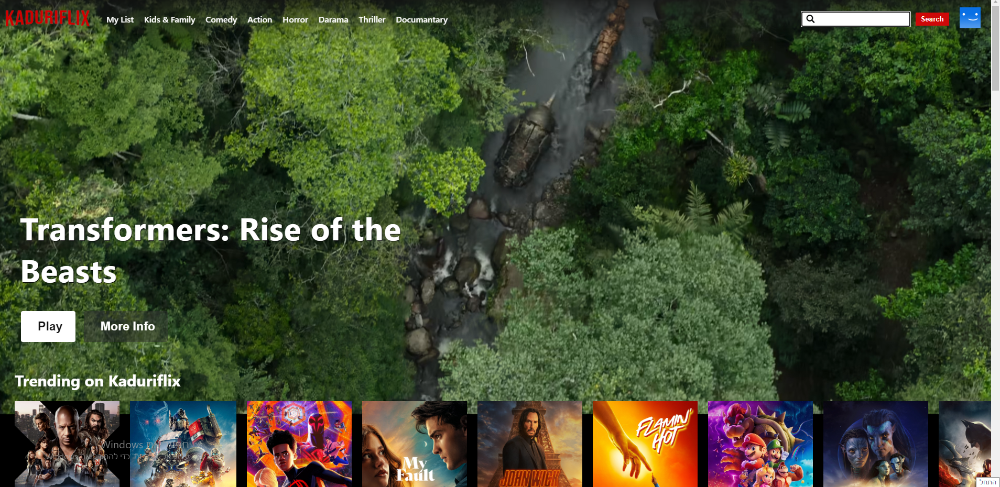
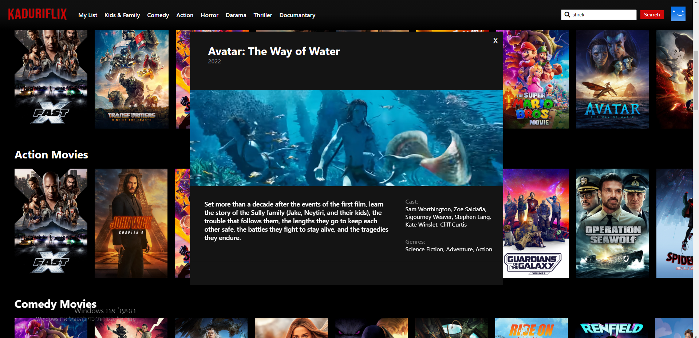
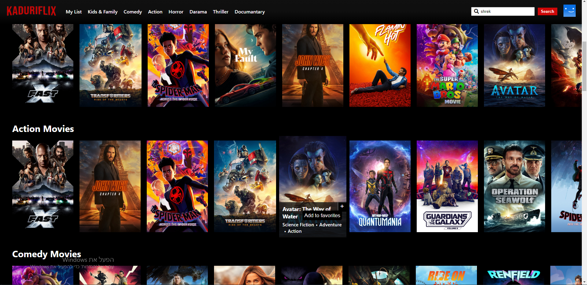
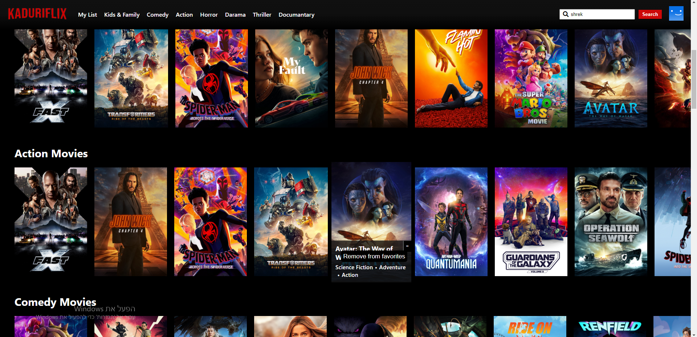
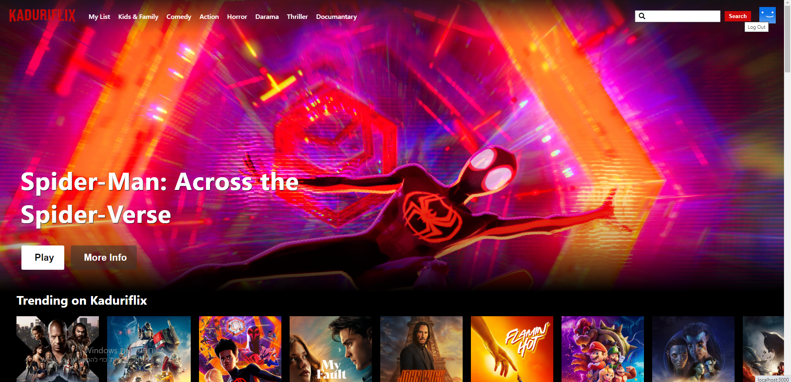

<p align="center">
  <h1 align="center">Kaduriflix: A Netflix Clone</h1>

  <p align="center">
    My implementation of Netflix using React.js, Node.js and MongoDB. Movie data was pulled from TMDB and trailer videos from Youtube.
    <br /><br />

<h2 style="display: inline-block">Table of Contents</h2>
<ol>
  <li>
    <a href="#about-the-project">About The Project</a>
    <ul>
      <li><a href="#built-with">Built With</a></li>
    </ul>
  </li>
  <li>
    <a href="#getting-started">Getting Started</a>
    <ul>
      <li><a href="#prerequisites">Prerequisites</a></li>
      <li><a href="#installation">Installation</a></li>
    </ul>
  </li>
  <li><a href="#usage">Usage</a></li>
</ol>

## About The Project

### Built With

- **[React](https://reactjs.org/)**
- **[Node.js](https://nodejs.org/en/)**
- **[MongoDB](https://www.mongodb.com/)**

## Getting Started

To run this app follow these instructions.

### Prerequisites

Install latest version of npm

  ```sh
  npm install npm@latest -g
  ```

### Installation

1. Clone the project
   ```sh
   git clone https://github.com/kadurinadav/kaduriflix-app.git
   ```
2. Go to project directory and run the client and the server as instructed below. 

#### server side
1. Navigate to the server folder:
   ```sh
   cd server
  ```
2. Install NPM packages:
   ```sh
     npm install
   ```
3. Create .env file in server directory.
4. Create database at MongoDB and add the uri to .env file
   ```sh
   DATABASE_URI=xxxxxxxxxxxxxxxxxxxxxxxxxxxxxxxx/DATABASE_NAME 
   ```
   for example DATABASE_URI = "mongodb://localhost:27017/kaduriflix-app"
5. Add your preferred PORT to .env file
   ```sh
   PORT=xxxx
   ```
6. Start the server
   ```sh
   node server.js
   ```
#### client side
1. Navigate to the client folder:
   ```sh
   cd client
  ```
2. Install NPM packages:
   ```sh
     npm install
   ```
3. Create .env file in client directory.
4. Request an API key from TMDB and add it to your .env
   ```sh
   REACT_APP_API_KEY=xxxxxxxxxxxxxxxxxxxxxxxxxxxxxxxx
   ```
5. Start the application
    ```sh
    npm start
    ```

## Usage

**Creating an Account**



1. Go to Sign Up page.
   - From the Sign In page, click the 'Sign up now' link below 'Sign In' button.
2. Input the necessary fields.
   - Both email and phone number has to be unique.
3. You'll be redirected to the login page. Enter your newly created credentials.

**Log In**



1. Go to Sign In page.
   - if you just started the app you will already be in the Sign in page.
   - From Sign Up page, click the 'Sign in now' link below 'Sign Up' button.
2. Input the necessary fields and proceed.

**Searching for a movie**



1. Click the search input on the navabr.
2. Input your search term and press the " enter.
3. To show all shows again, clear the search input and click the "Search" button.
4. you will be directed to search Page and all the results will be displayed.

**Play Trailer for a movie**



1. Click the movie poster that you want to play is trailer.
2. A trailer window will open with the trailer video in addition to movie details and overview.
3. To exit the trailer window click the "X" button on the top-right corner.

**Add movie to "my List"**



1. When you hover over a movie poster in the home page, in one of the genre pages or in the search page, a "+" button will be displayed. In order to add the movie to my List, click on that button.
2. Now this movie will be displayed when you will go to My List page through the "My List" button on the navbar.

**Remove movie from "my List"**



1. When you hover over a movie poster in the home page, in one of the genre pages or in the search page, a "-" button will be displayed if this movie is already in "My List". In order to remove the movie from my List, click on that button.
2. Now this movie will not be displayed anymore in "My List" page.
3. Another way to remove a movie from "My List" is from the "My List" page itself. When you hover over a movie poster in "My List" page a "-" button will be displayed because all the movies that appears there is on "My List". So in order to remove the movie, click on the "-" button.

**Log Out**



1. In order to log out from the user click on the blue icon on the right side of the navbar.

